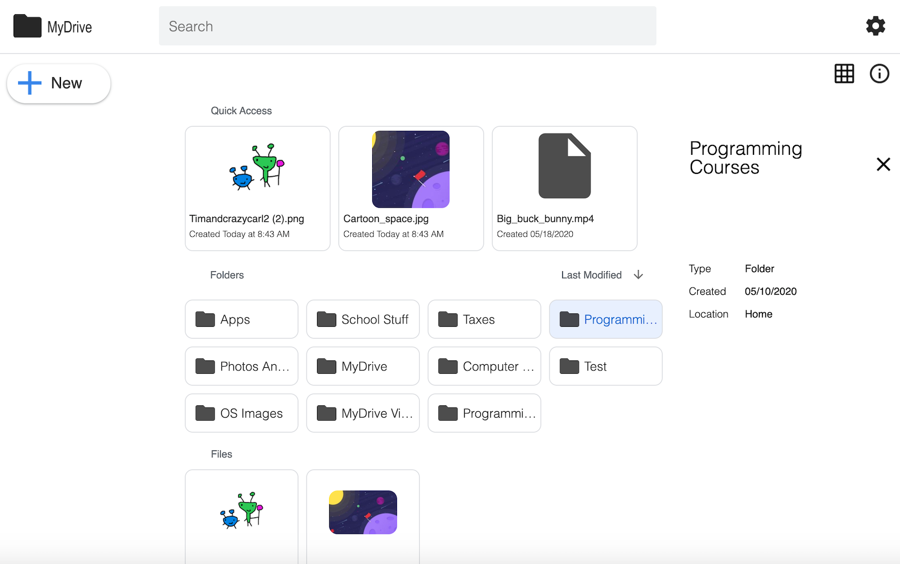

# 

# MyDrive

MyDrive is an Open Source Cloud Server (Similar To Google Drive), the service uses mongoDB to store file/folder metadata, and supports multiple databases to store the file chunks, such as Amazon S3, the Filesystem, or just MongoDB. MyDrive is built using Node.js, and Typescript. The service now even supports Docker images! 

## Index

* [Features](#features)
* [Installation](#installation)
* [WebUI For Encryption Key](#webui-for-encryption-key)
* [Docker](#docker)
* [Environment Variables](#environment-variables)
* [Screenshots](#screenshots)
* [Wiki](https://github.com/subnub/myDrive/wiki)
* [Demo](#demo)

## Features

* Upload Files
* Download Files
* Share Files
* Multiple DB Support (MongoDB, S3, Filesystem)
* Photo Viewer
* Video Viewer
* Thumbnails
* One-time download links
* Move Folder/Files
* Mobile Support
* Docker Support
* Search/Filter Options
* AES256 Encryption

## Installation

Required:
- Node.js (13+ Recommended)
- MongoDB (Unless using a service like Atlas)

Windows users will usually need both the microsoft visual build tools, and python 2. These are required to build the sharp module:
- Visual Tools: http://go.microsoft.com/fwlink/?LinkId=691126
- Python 2: https://www.python.org/downloads/release/python-2717/

Linux users will need to make sure they have 'build-essential' installed:
```bash
sudo apt-get install build-essential
```

Setup:
>Install Node Modules
``` javascript
npm install
```

>Create Environment Variables, Users can use the built in command to easily create the needed Environment files, or view the Environment Variables section to see how to manually create the files. 
``` javascript
npm run setup
```

>Run the build command
``` javascript
npm run build
```

>(Optional) Create the MongoDB indexes, this increases performance. MongoDB must be running for this command to work.
```javascript
npm run create-indexes-database
```

>Start the server
``` javascript
npm run start
```

## WebUI For Encryption Key

MyDrive will first host a server on http://localhost:3000 in order to safely get the encryption key, just navigate to this URL in a browser, and enter the encryption key. 

If you're using a service like SSH or a Droplet, you can forward the localhost connection safely like so:
```bash
ssh -L localhost:3000:localhost:3000 username@ip_address
```

Note: You can also disable using the webUI for the encryption key by providing a key in the server enviroment variables (e.g. KEY=password), but this is not recommended because it greatly reduces security. 

## Docker

MyDrive has built in Docker support, there are two options when using Docker, users can either use the Docker image that has MongoDB built in, or use the Docker image that just has the MyDrive image (If you're using a service like Atlas).

Create the Docker environment variables by running the 'npm run setup' command as seen in the installation section. Or by manually creating the file (e.g. docker-variables.env on the root of the project, see the enviroment section for more infomation).

Docker with mongoDB image:
```bash
docker-compose build
```

Docker without mongoDB image:
```bash
docker-compose -f docker-compose-no-mongo.yml build
```
Start the Docker Image:
```bash
docker-compose up
```

## Screenshots

## Environment Variables

Create a config folder on the root of the project, and create a file with the name prod.env for the server. For the client variables create a .env.production file in the root of the project. 

Server Environment Variables:

- MONGODB_URL (Required): Sets the MongoDB URL, this should also work with DocumentDB. 
- HTTP_PORT (Required): Sets the HTTP port number.
- HTTPS_PORT (Required): Sets the HTTPS port number.
- PASSWORD (Required): Sets the JWT password. 
- DB_TYPE (Required): Sets the Database Type, options include s3/mongo/fs.
- NODE_ENV (Required): Must be set to 'production'.
- SSL (Optional): Enables SSL, place certificate.crt, certificate.ca-bundle, and certificate.key at the root of the project.
- KEY (Optional): Encryption key for data, this is not recommended, please use the built in webUI for setting the key.
- DOCKER (Optional/Required): Sets the server to use docker, set this to true.
- FS_DIRECTORY (Optional/Required): Sets the directory for file data on the file system. 
- S3_ID (Optional/Required): Sets the Amazon S3 ID.
- S3_KEY (Optional/Required): Sets the Amazon S3 Key.
- S3_BUCKET (Optional/Required): Sets the Amazon Bucket.
- ROOT (Optional): Uses a filesystem path, is used for storage space.
- URL (Optional): Allows to specify URL to host on, this is usually not needed. 
- USE_DOCUMENT_DB (Optional): Enables documentDB, this is experimental.
- DOCUMENT_DB_BUNDLE (Optional): Enables SSL with documentDB.
- BLOCK_CREATE_ACCOUNT (Optional): Blocks the ability to create accounts.

Client Environment Variables

- REMOTE_URL (Required): Sets the Remote URL for the client.
- DISABLE_STORAGE (Optional): Disables storage, use this if you're not using ROOT on the server.

## Wiki

For a more detailed list of myDrive features, including examples with images, visit the wiki here: https://github.com/subnub/myDrive/wiki

## Demo

Demo: https://mydrive-demo.herokuapp.com/
- Note: The Upload and Download Features, and other core features, are disabled in the demo.

## Questions? Feature Requests? Hiring? Contact Me!
Contact Email: kyle.hoell@gmail.com
