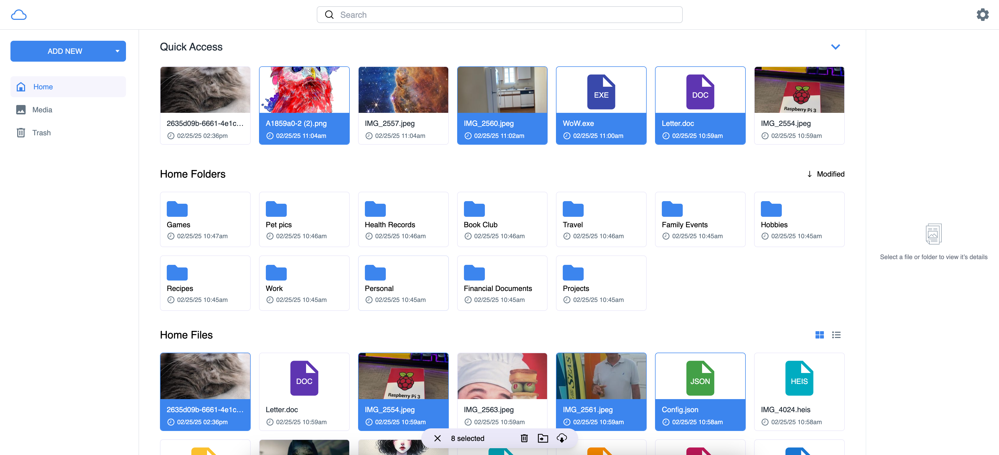
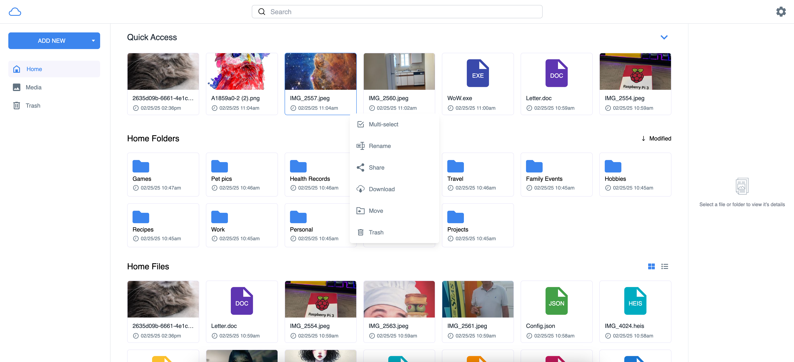
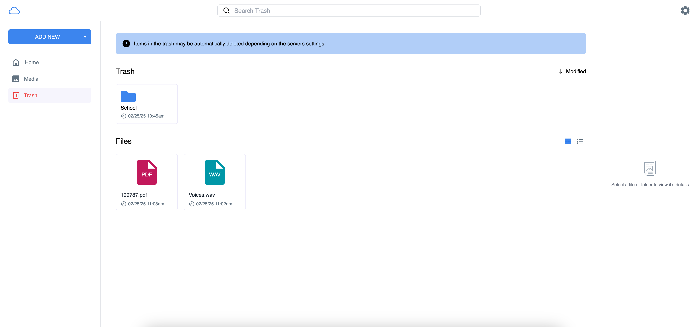

# 

# ☁️ MyDrive

MyDrive is an Open Source cloud file storage server (Similar To Google Drive). Host myDrive on your own server or trusted platform and then access myDrive through your web browser. MyDrive uses mongoDB to store file/folder metadata, and supports multiple databases to store the file chunks, such as Amazon S3, or the Filesystem.

[Main myDrive website](https://mydrive-storage.com/)

[Live demo](http://143.244.181.219:3000/)

## 🔍 Index

- [Features](#features)
- [Tech stack](#tech-stack)
- [Installation (non docker)](#installation)
- [Docker installation](#docker)
- [Common installation issues](#common-installation-issues)
- [Screenshots](#screenshots)
- [Video](#video)
- [Live demo](#live-demo)
- [Feature requests/bug reports](#bugs)
- [Updating from a previous version of myDrive](#updating)
- [Known issues and future improvments](#known-issues)

<span id="features"></span>

## ⭐️ Features

- Upload Files
- Download Files
- Upload Folders
- Download Folders (Automatically converts to zip)
- Multiple DB Support (Amazon S3, Filesystem)
- Photo, Video Viewer and Media Gallery
- Generated Photo And Video Thumbnails
- File Sharing
- PWA Support
- AES256 Encryption
- Service Worker
- Mobile Support
- Docker
- Email Verification
- JWT (Access and Refresh Tokens)

<span id="tech-stack"></span>

## 👨‍🔬 Tech Stack

- React
- Typescript
- Node.js
- Express
- MongoDB
- Vite
- Jest

<span id="installation"></span>

## 💻 Installation

Required:

- Node.js (20 Recommended)
- MongoDB (Unless using a service like Atlas)
- FFMPEG (Optional, used for video thumbnails)
- build-essential package (If using linux)

<br/>

Setup (Non Docker Method):

> Install Node Modules

```javascript
npm install
```

<br>

> Create Environment Variables:

> You can find enviroment variable examples under: <br />  
> [backend/config](backend/config) -> Backend Enviroment Variables  
> [src/config](src/config) -> Frontend Enviroment Variables

> Simply remove the .example from the end of the filename, and fill in the values.  
> Note: In most cases you will only have to change FE enviroment variables for development purposes.

<br />

> Run the build command

```javascript
npm run build
```

<br />

> Start the server

```javascript
npm run start
```

<span id="common-installation-issues"></span>

#### Possible installation issues

Make issue

```javascript
npm error gyp ERR! stack Error: not found: make
```

This is because you do not have the build essentials installed which is required for Linux. You can install them by running the following command:

```javascript
sudo apt-get install build-essential
```

<br/>

Memory issue

```javascript
Aborted (core dumped)
```

When running the `npm run build` command it may take more memory than node allows by default. You will get the above error in such a case. To fix this, you can run the following command instead when building:

```javascript
NODE_OPTIONS="--max-old-space-size=4096" npm run build
```

You can read more about this issue [here](https://stackoverflow.com/questions/38558989/node-js-heap-out-of-memory).

<span id="docker"></span>

## 🐳 Docker

Setup:

> Create Environment Variables:

> You can find enviroment variable examples under: <br />  
> [backend/config](backend/config) -> Backend Enviroment Variables  
> [src/config](src/config) -> Frontend Enviroment Variables

> Simply remove the .example from the end of the filename, and fill in the values.  
> Note: In most cases you will only have to change FE enviroment variables for development purposes.

<br />

> Start the Docker image

```javascript
npm run docker:production
```

NOTE: I made an oversight in the docker command, since it requires npm to be installed in order to run the above command, I am working on a fix for this, but here is the command itself that npm runs for now.

```javascript
docker-compose -p mydrive-production -f docker-compose-production.yml --env-file ./backend/config/.env.production up
```

<span id="screenshots"></span>

## 📸 Screenshots

Modern and colorful design


Upload Files


Download Files


Image Viewer


Video Viewer


Media Gallery


Share Files


Search For Files/Folders


Move File/Folders


Multi-select


Custom context menu


Trash


<span id="video"></span>

## 🎥 Video

I created a short YouTube video, showing off myDrives design and features:

[](https://www.youtube.com/watch?v=IqmTvAFBszg "myDrive 4 (open source Google Drive alternative) - UI and feature overview
")

<span id="live-demo"></span>

## 🕹️ Live demo

[Demo](http://143.244.181.219:3000/)

Note: Creating, deleting and other features are disabled in the demo. Also the service worker is not enabled in the demo, images thumbnails are not cached because of this.

Also this is just a 512mb RAM droplet go easy on her.

<span id="bugs"></span>

## 👾 Bug reports and feature requests

Please only open issues for actual bugs, feature requests or discussions should happen in Discussions or via my email.

Contact Email: kyle.hoell@gmail.com

<span id="updating"></span>

## ⬆️ Updating from a previous version of myDrive

If you are upgrading from myDrive 3 there is some data migration and scripts you must run for myDrive 4 to work properly.

> Run the migration script <br />
> Note: Make sure you have env variables set

```javascript
npm run migrate-to-mydrive4
```

Also, if you are updating from myDrive 3, or if you did not have video thumbnails enabled and would like to enable them now you can do so by running the following command:<br />
Note: Make sure you have video thumbnails enabled in your env variables and FFMPEG installed.

```javascript
npm run create-video-thumbnails
```

<span id="known-issues"></span>

## 🔮 Known issues and future improvments

#### Issues

- The docker compose command is currently setup incorrectly since it requires npm to be installed, I am working on a fix for this. (Top priority)
- Video streaming does not always work, especially on Safari.
- PWA downloads does not work on iOS (This may be a current iOS limitation and not a myDrive issue).
- Upload folder will sometimes fail on complex folder structures.
- Generating video thumbnails with the default method will often fail, requiring the whole file to be downloaded to temporary storage and then the thumbnail generated from that.

#### Future improvments

- Docker image (Top priority)
- OIDC Support (Top priority)
- Option to disable encryption
- File sync from a local device
- An alternative to using mongoDB
- Dark mode
- Enhance service worker, currently only caches thumbnails. This includes potentially adding offline support.
- Typescript type cleanup
- Better error handling
- Logging
- More test coverage (currently only basic backend tests)
- Some tailwind classes still need some slight tweaking
