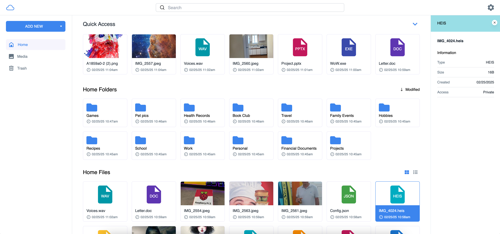
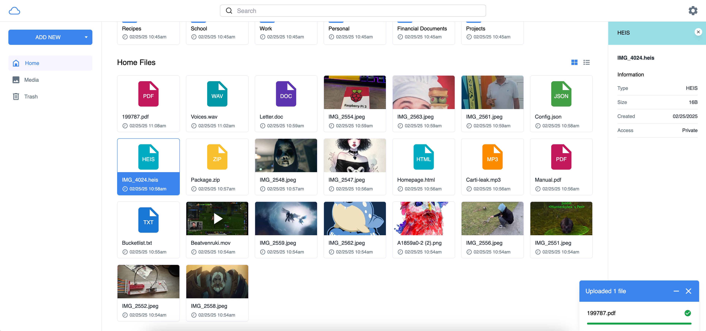
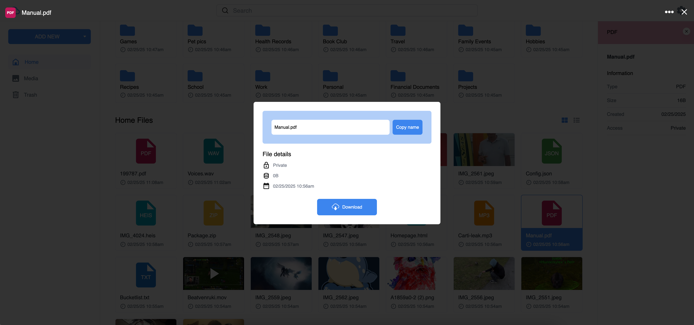
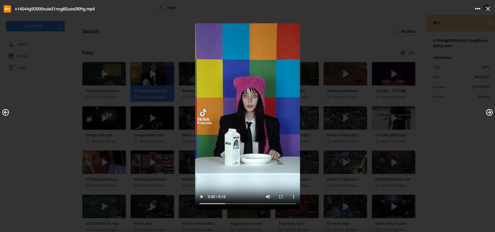
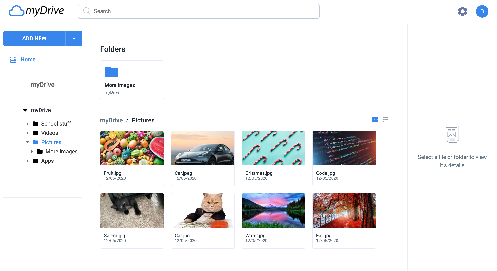
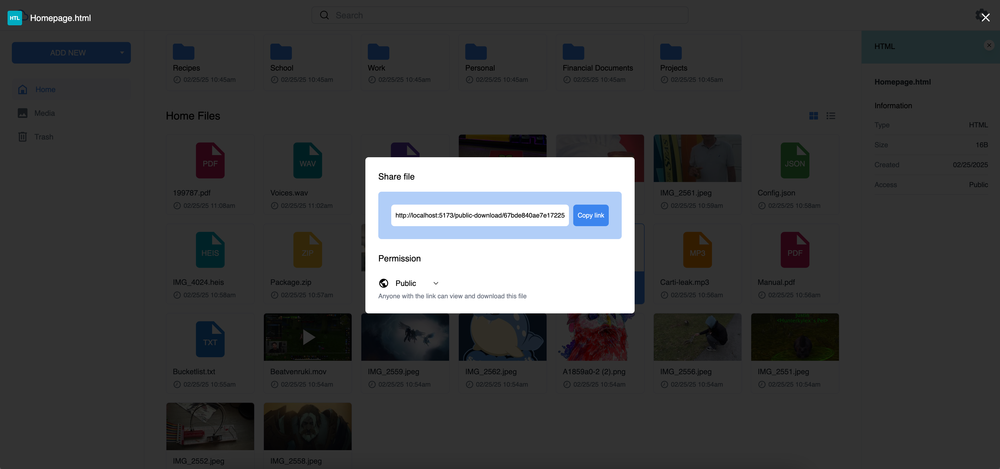
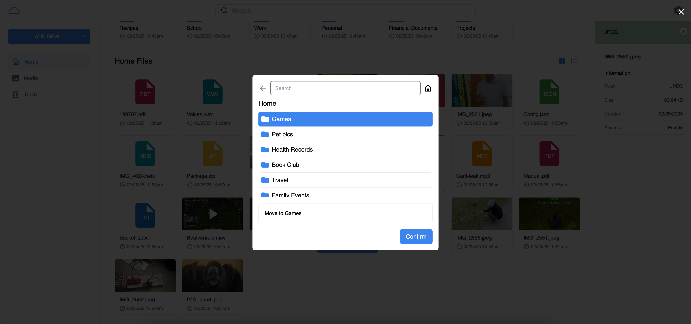
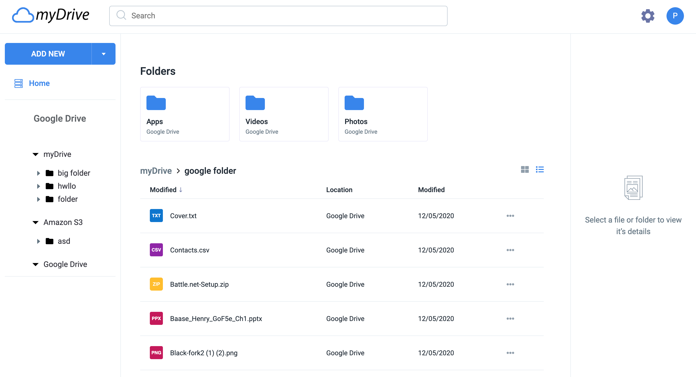

# 

# MyDrive

MyDrive is an Open Source cloud file storage server (Similar To Google Drive). Host myDrive on your own server or trusted platform and then access myDrive through your web browser. MyDrive uses mongoDB to store file/folder metadata, and supports multiple databases to store the file chunks, such as Amazon S3, the Filesystem, or just MongoDB. MyDrive is built using Node.js, and Typescript. The service now even supports Docker images! 

[Main myDrive website](https://mydrive-storage.com/)

Go to the main myDrive website for more infomation, screenshots, and more.

## Index

* [Features](#features)
* [Installation](#installation)
* [Guided Installation](https://github.com/subnub/myDrive/wiki/Guided-Installation-Setup)
* [Guided Installation (Docker)](https://github.com/subnub/myDrive/wiki/Guided-Installation-Setup-(Docker))
* [Updating from a previous version of myDrive](#updating-from-a-previous-version-of-mydrive)
* [WebUI For Encryption Key](#webui-for-encryption-key)
* [Docker](#docker)
* [Environment Variables](#environment-variables)
* [Screenshots](#screenshots)
* [Wiki](https://github.com/subnub/myDrive/wiki)
* [Video](#video)
* [Demo](#demo)
* [Fund/Donate](#fund)

## Features

* Upload Files
* Download Files
* Google Drive Support
* Personal S3 storage support
* Share Files
* Multiple DB Support (MongoDB, S3, Filesystem)
* Photo Viewer
* Video Viewer
* Thumbnails
* One-time download links
* Move Folder/Files
* Mobile Support
* Docker Support
* Search/Filter Options
* AES256 Encryption
* Access/Refresh tokens

## Installation

Required:
- Node.js (15 Recommended)
- MongoDB (Unless using a service like Atlas)

Windows users will usually need both the microsoft visual build tools, and python 2. These are required to build the sharp module:
- Visual Tools: http://go.microsoft.com/fwlink/?LinkId=691126
- Python 2: https://www.python.org/downloads/release/python-2717/

Linux users will need to make sure they have 'build-essential' installed:
```bash
sudo apt-get install build-essential
```

Setup:
>Install Node Modules
``` javascript
npm install
```

>Run the build command
``` javascript
npm run build
```

>Create Environment Variables: Easily create enviroment variables with the built in command. This command will start a server where you can type in the enviroment variables through a webUI on your browser.
``` javascript
npm run setup
```

>Rebuild the project after entering enviroment variables
``` javascript
npm run build
```

>(Optional) Create the MongoDB indexes, this increases performance. MongoDB must be running for this command to work.
```javascript
npm run create-indexes-database
```

>Start the server
``` javascript
npm run start
```

## WebUI For Encryption Key

MyDrive will first host a server on http://localhost:3000 in order to safely get the encryption key, just navigate to this URL in a browser, and enter the encryption key. You can access this URL through your IP address also, but localhost is recommended to avoid man in the middle attacks.

If you're using a service like SSH or a Droplet, you can forward the localhost connection safely like so:
```bash
ssh -L localhost:3000:localhost:3000 username@ip_address
```

Note: You can also disable using the webUI for the encryption key by providing a key in the server environment variables (e.g. KEY=password), but this is not recommended because it greatly reduces security. 

## Docker

MyDrive has built in Docker support, there are two options when using Docker, users can either use the Docker image that has MongoDB built in, or use the Docker image that just has the MyDrive image (If you're using a service like Atlas).

Create the Docker environment variables by running the 'npm run setup' command as seen in the installation section. Or by manually creating the file (e.g. docker-variables.env on the root of the project, see the environment section for more infomation).

Docker with mongoDB image:
```bash
docker-compose build
```

Docker without mongoDB image:
```bash
docker-compose -f docker-compose-no-mongo.yml build
```
Start the Docker Image:
```bash
docker-compose up
```

## Updating from a previous version of myDrive

If you are running a previous version of myDrive such as myDrive 2 you must perform the following steps before you will be able to run myDrive properly. An easy way to tell if you are running a previous version of myDrive is checking if you have the old UI/look of myDrive 2. If your home page looks different than the myDrive 3 design you are most likely running myDrive 2. 

First I recommend creating a new folder for myDrive 3, so just incase you are having difficulties with myDrive 3 you can easily revert to myDrive 2.

After you install the node modules, run setup, and build the project. You can then run the script to clear all the authentication tokens from all the users. This is because the Schema for tokens has changed, this will cause all users to have to log back in.

Run the following command: 

>Remove old tokens
``` javascript
npm run remove-tokens
```

If successful you should see in the terminal the number of users that has their tokens removed, if you run into any errors check your environment variables and make sure the project is built properly.  

## Screenshots

Modern and colorful design


Upload Files


Download Files


Image Viewer


Video Viewer


Image Thumbnails


Share Files


Search For Files/Folders


Move File/Folders


Google Drive Support



## Environment Variables

You can easily create environment variables using the built in setup tool 'npm run setup', or manually create the files.

Create a config folder on the root of the project, and create a file with the name prod.env for the server. For the client variables create a .env.production file in the root of the project. 

Docker: If you're using Docker, instead create a file named 'docker-variables.env' on the root of the project. You must also include DOCKER=true in the servers environment variables. 

Server Environment Variables:

- MONGODB_URL (Required): Sets the MongoDB URL, this should also work with DocumentDB. 
- HTTP_PORT (Required): Sets the HTTP port number.
- HTTPS_PORT (Required): Sets the HTTPS port number.
- REMOTE_URL (Required): This is the URL that the client navigates to in their browser in order to access myDrive. This is needed for things like the Google Drive redirect URL, and including the URL when sending email verification/password reset emails.
- PASSWORD_ACCESS (Required): Sets the JWT secret for access tokens.
- PASSWORD_REFRESH (Required): Sets the JWT secret for refresh tokens.
- PASSWORD_COOKIE (Required): Sets the secret for cookies.
- DB_TYPE (Required): Sets the Database Type, options include s3/mongo/fs.
- NODE_ENV (Required): Must be set to 'production'.
- SSL (Optional): Enables SSL, place certificate.crt, certificate.ca-bundle, and certificate.key at the root of the project. Set this to 'true'
- SECURE_COOKIES (Optional): Makes cookies secure, which means they can only be sent with HTTPS/SSL. Choose this option only if you are using HTTPS.
- KEY (Optional): Encryption key for data, this is not recommended, please use the built in webUI for setting the key.
- DOCKER (Optional/Required): Sets the server to use docker, set this to 'true'.
- FS_DIRECTORY (Optional/Required): Sets the directory for file data on the file system. 
- S3_ID (Optional/Required): Sets the Amazon S3 ID.
- S3_KEY (Optional/Required): Sets the Amazon S3 Key.
- S3_BUCKET (Optional/Required): Sets the Amazon Bucket.
- ROOT (Optional): Uses a filesystem path, is used for storage space.
- URL (Optional): Allows to specify URL to host on, this is usually not needed. 
- USE_DOCUMENT_DB (Optional): Enables documentDB, this is experimental, set this to 'true'.
- DISABLE_EMAIL_VERIFICATION (optional): Disabled email verification when creating an account. Also will not allow users to reset their password with an email.
- SENDGRID_EMAIL (optional): If you are using email verification it is done through sendgrid, enter the sendgrid email address you would like to use. This is the email address users will see when they need to verify their account, or reset their password.
- SENDGRID_KEY (optional): This is the sendgrid API key.
- DOCUMENT_DB_BUNDLE (Optional): Enables SSL with documentDB, set this to 'true'.
- BLOCK_CREATE_ACCOUNT (Optional): Blocks the ability to create accounts, set this to 'true'.

Client Environment Variables

- REMOTE_URL (Required): Sets the Remote URL for the client.
- DISABLE_STORAGE (Optional): Disables storage, use this if you're not using ROOT on the server.

## Wiki

For a more detailed setup guide please visit the main myDrive site: https://mydrive-storage.com/

The wiki includes guided setup: https://github.com/subnub/myDrive/wiki

## Video

I created a short YouTube video, showing off myDrives design and features: https://www.youtube.com/watch?v=_bcADP6hDDI&feature=youtu.be

## Demo

Demo: https://mydrive-3.herokuapp.com/
- Note: The Upload and Download Features, and other core features, are disabled in the demo.

## Fund

Patreon: https://www.patreon.com/subnub

## Questions? Feature Requests? Hiring? Contact Me!
Contact Email: kyle.hoell@gmail.com